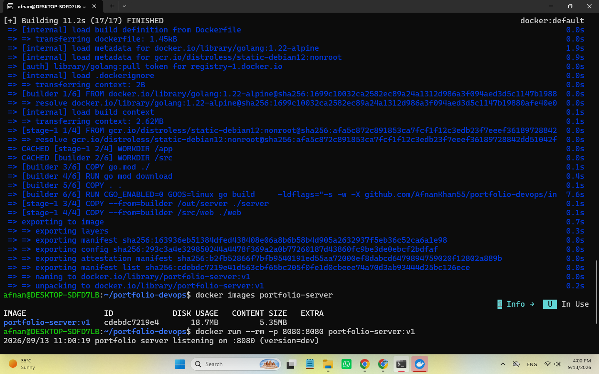
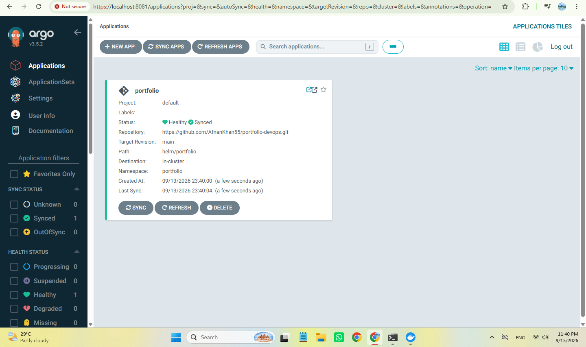
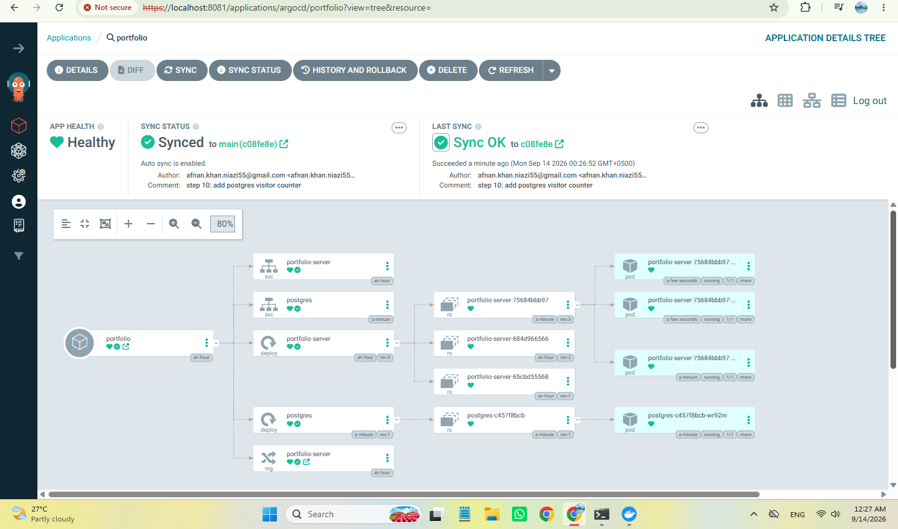
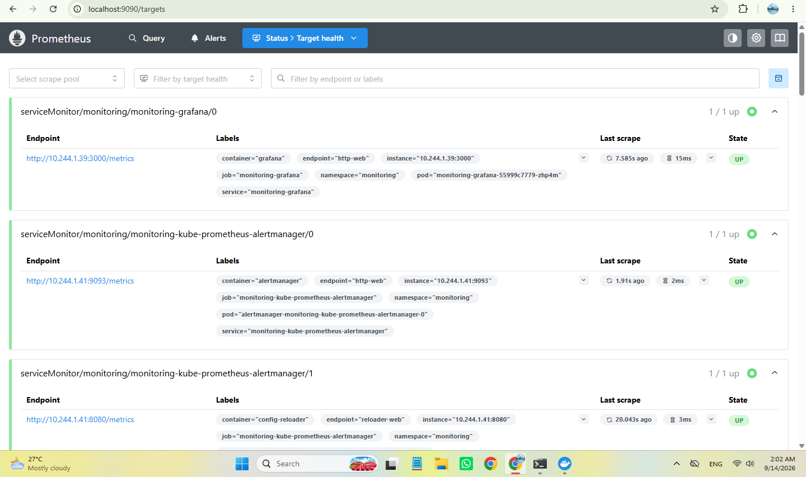
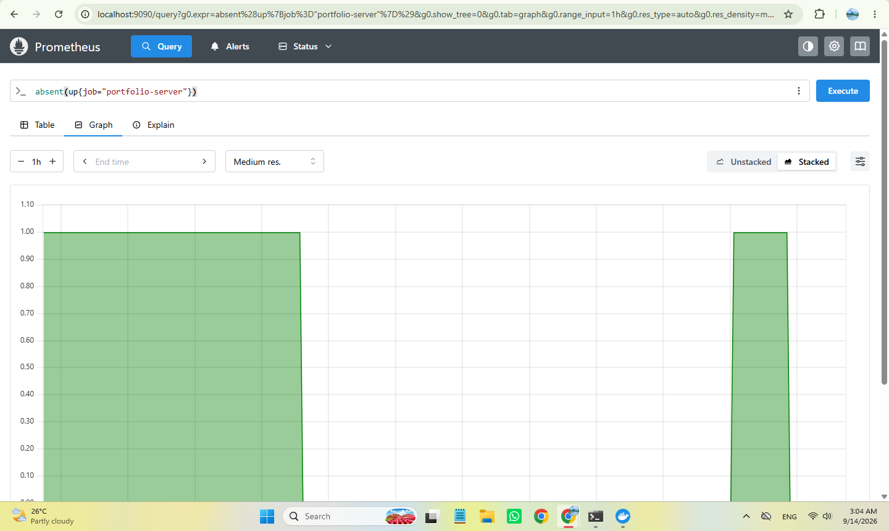
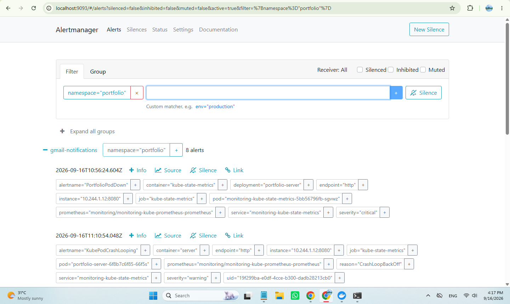
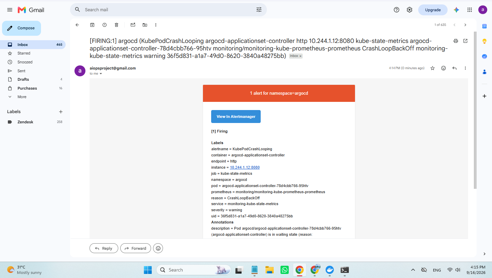

# Portfolio DevOps Platform — Automated Observability & GitOps Pipeline

A production-grade, self-healing Kubernetes deployment pipeline and observability stack for a Go web application running on a local Kind cluster. Built using GitOps principles with Argo CD, automated CI/CD via GitHub Actions, and complete end-to-end monitoring with Prometheus, Grafana, Loki, and Alertmanager.

---

## 📐 System Architecture

### Key Architectural Flow
1. **Developer Lifecycle:** Code changes pushed to GitHub trigger an automated GitHub Actions CI pipeline (`go vet`, `go test`, multi-stage Docker build).
2. **Container Registry:** Built non-root distroless images are pushed to GitHub Container Registry (GHCR) and synced via a local registry mirror.
3. **GitOps Deployment:** Argo CD continuously monitors the repository's Helm chart (`values.yaml`), automatically applying and self-healing cluster state without manual `kubectl` intervention.
4. **Application Stack:** Go web application serving routes backed by an in-cluster PostgreSQL instance.
5. **Observability & Alerting:** Prometheus scrapes custom metrics via a `ServiceMonitor`. When replica outages occur, custom `PrometheusRule` resources trigger Alertmanager to route alerts through Gmail SMTP using secure mounted Kubernetes Secrets.

---

## 🛠️ Infrastructure & Key Features

* **Application Runtime:** High-performance Go HTTP server with graceful shutdown and PostgreSQL visitor logging.
* **Container Security:** Multi-stage Docker builds compiled down to `distroless/static-debian12:nonroot` runtime containers (shell-less, unprivileged).
* **GitOps Continuous Delivery:** Argo CD with `prune: true` and `selfHeal: true` auto-reconciling cluster drift.
* **Monitoring & Alerting Stack:** Full Prometheus Operator deployment monitoring pod availability and request metrics, Grafana/Loki logs, and integrated Gmail SMTP alerting.

---

## 📸 System Verification & Operations

### 1. Application & Development Setup
The portfolio server running in-cluster behind Nginx Ingress, tracked via Git commits and pushed to GitHub.

### 2. Container Engine & Local Registry
Kind dual-node cluster running on Docker Desktop with custom containerization and image pushes to a local registry.

### 3. Argo CD Deployment & GitOps
Argo CD managing cluster state and maintaining resource dependency trees (`Service`, `Deployment`, `Pods`, `Ingress`).

### 4. Prometheus Monitoring & Grafana / Loki Observability
Prometheus active scraping configuration connected to internal services, complemented by Grafana dashboarding and Loki log aggregation.

### 5. Alertmanager & Gmail SMTP Notifications
Alertmanager capturing active triggers across the namespace and firing email alerts directly via Gmail.

---

